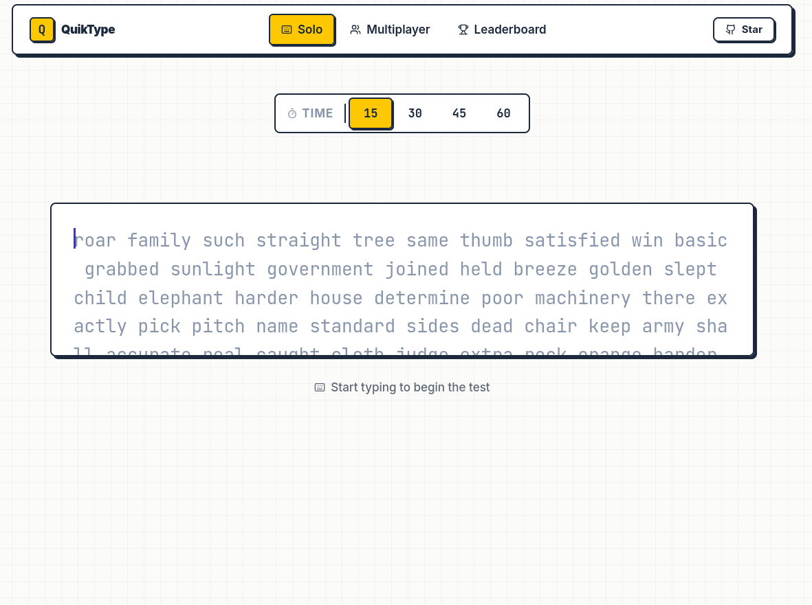

# QuikType

A high-performance, real-time multiplayer typing speed test application built with Next.js and Socket.IO.

Live Application: [quik-type.vercel.app](https://quik-type.vercel.app)

## Screenshot



## Features

### Core Features
- Countdown Timer: A five-second countdown synchronized across players before a test begins.
- Dynamic Test Phase Management: React hooks managing setup, countdown, test, and result phases.
- Real-Time Calculations: Words Per Minute (WPM), raw WPM, accuracy, and character count computed instantly.
- Adaptive Word Generation: Dynamic generation of words with configurable typing duration.

### Multiplayer Capabilities
- Room System: Create or join custom rooms using generated room codes.
- Synchronized Test Start: Coordinated countdown and test launch for all participants.
- Leaderboard Ranking: Post-test WPM and accuracy metrics compiled and ranked.
- Connection Recovery: Socket.IO connection state recovery to handle temporary network issues.

## Tech Stack

### Frontend
- Next.js 16
- React 19
- TypeScript
- Tailwind CSS 4
- Lucide React (Icons)
- Socket.IO Client

### Backend
- Express.js
- Socket.IO Server
- CORS integration for secure origin sharing

## Getting Started

### Prerequisites
- Node.js 18 or later
- npm, yarn, or pnpm

### Installation

1. Clone the repository:
   ```bash
   git clone https://github.com/mystic-06/quik-type.git
   cd quik-type
   ```

2. Install the project dependencies:
   ```bash
   npm install
   ```

3. Configure the environment variables:
   Copy the example environment file and fill in your details:
   ```bash
   cp .env.example .env.local
   ```
   Note: Configure FRONTEND_URL and NEXT_PUBLIC_SOCKET_URL to point to your respective backend and frontend hostnames.

### Run in Development

1. Start the Socket.IO Express backend server:
   ```bash
   npm run server:dev
   ```

2. In a separate terminal session, start the Next.js development frontend:
   ```bash
   npm run dev
   ```

3. Access the application in your browser at:
   [http://localhost:3000](http://localhost:3000)

### Run in Production

1. Build the production assets:
   ```bash
   npm run build
   ```

2. Start the production Next.js server:
   ```bash
   npm start
   ```

3. Start the production backend server:
   ```bash
   npm run server
   ```

## Environment Variables

For deployments, set the following environment variables:

- `NEXT_PUBLIC_SOCKET_URL`: URL of the deployed Socket.IO server.
- `PORT`: Server port (defaults to 3001).
- `NODE_ENV`: Set to "production".
- `FRONTEND_URL`: URL of the frontend client (for CORS configuration).

## Project Structure

```
src/
├── app/
│   ├── room/[roomId]/     # Dynamic room interfaces
│   ├── multiplayer/       # Multiplayer lobby logic
│   ├── leaderboard/       # Score rankings
│   └── page.tsx           # Application landing page
├── components/
│   ├── CountdownPhase.tsx # Pre-test countdown UI
│   ├── Header.tsx         # Navbar and branding
│   ├── SetupPhase.tsx     # Room configuration UI
│   ├── ResultPhase.tsx    # Post-game statistics and rankings
│   └── TypingArea.tsx     # Core typing game logic
├── hooks/
│   └── useSocket.ts       # Socket.IO event listener hook
└── server/
    ├── config/            # CORS and server configurations
    ├── controllers/       # Socket.IO connection event controllers
    ├── jobs/              # Background clean-up scripts
    ├── managers/          # Room status and state managers
    ├── routes/            # REST API endpoints
    └── index.js           # Server entry point
```

## License

This project is private and not licensed for public use.
